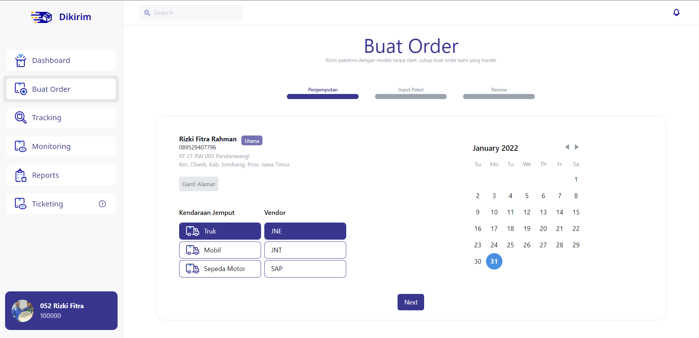

<h1 align="center">
   
  Dikirim
   
</h1>
<h4 align="center">Platform kirim paket</h4>

 

## Tech Stack

-   Backend
    -   Node
    -   Express
    -   Typescript
    -   Prisma ORM
-   Frontend
    -   Next JS
    -   Typescript

## How To Run

-   create database `learn_dikirim`
-   init yarn `yarn`
-   bootstrap packages `yarn lerna bootstrap`
-   Generate Prisma Client `yarn prisma`
-   Run backend `yarn be`
-   Run frontend `yarn fe`

## Need Your Help

Hubungi saya jika ingin berkontribusi
